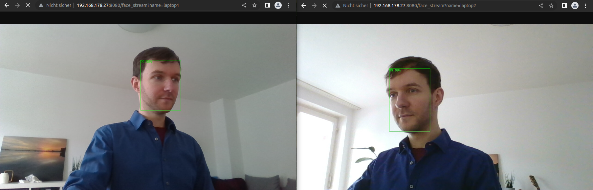

# InferCam ONNX

Client/server face detection from your webcam with [`tokio`][tokio],
[`axum`][axum], [`tract-onnx`][tract] and the lightweight
[ultraface network][ultraface-gh].



In the example image above, we use two laptops. Both run a `socket_sender` client
and send image streams to the second laptop, which runs the inference for
face detection on both of those streams concurrently with the `infer_server`. We
access both streams from the first laptop. This show-cases a few features:

- Concurrent inference of several streams on the server
- Sending image streams from edge devices over the network (by separating the
  capturing and inference of streams, we can have low-powered devices to send
  streams while a performant server does the inference)
- Access to the streams over the network

Run with:

```sh
# server
RUST_LOG=debug cargo run --release --bin infer_server

# client
RUST_LOG=debug cargo run --release --bin socket_sender
```

Then check e.g. http://127.0.0.1:3000/face_stream?name=simon

## Overview

This is my second implementation of this project. Changes to the first version:

- In the first version, we had a monolith that captured frames, infered faces,
  drew the results on the frames and served them in the browser. In this
  version, capturing frames and infering them are separated into two binaries.
  By separating the capturing from the inference/serving, we can capture and
  send a stream also from devices which are not powerful enough to do the
  inference. Inference in the cloud also becomes possible.
- The `infer_server` is powered by the [`axum`][axum] framework, receives
  streams and serves endpoints of both the raw streams and streams with faces
  infered. The previous version used [`actix-web`][actix-web] as web framework,
  switching to [`axum`][axum] was mostly curiosity.
- `socket_sender` establishes a TCP connection to the `infer_server` and streams
  frames to it which can be shown raw or infered in the browser.
- In the first version, opening a tab to either the raw or infered stream
  endpoint triggered an independent run of the capture function. So opening four
  tabs meant having four streams capture independently. In the refactored
  version, one stream can be viewed by many people at the same time.
- Broadcast channels enable us to serve the same raw stream to many people.
- With a combination of `mpsc` and broadcast channels, we make sure that a raw
  stream is only infered if there is at least one person watching the infered
  stream and that at the same time several people can watch the stream while the
  inference has to be done only once per frame.
- In the first version, we used the JPEG encoding/decoding built into the
  `image-rs` library. On my machine, this means 60-70ms delay to decode a frame.
  For this reason, we captured the frame directly as raw bitmap when we wanted
  to do inference with it. This however cannot be streamed directly to the
  browser. In this version, we capture the frames as JPEG so that they can be
  served directly as raw stream to the browser, but we use the performant
  [turbojpeg][turbojpeg] library which yields far better performance for
  decoding/encoding (around 15ms instead of 60ms on my machine).

Things that stayed the same:

- Images are captured from the `/dev/video0` interface using the `libv4l-dev`
  library on Linux with the [`rscam`][rscam] crate.
- Captured frames are passed through a pre-trained network stored in the
  [`onnx`][onnxruntime] format, powered by the no-frills `onnxruntime` wrapper
  [`tract`][tract].
- Post-processing (mainly non-maximum suppression) is done in native Rust.
- Detected faces are drawn as bounding boxes on the frame with their confidences
  using [`imageproc`][imageproc].

## Building & Running

- Make sure that you have the `libv4l-dev` package and a few other
  build-related libraries installed on your system:

```bash
sudo apt update && sudo apt install -y libv4l-dev build-essential nasm
```

- Download a build of the `onnxruntime` from Microsoft
  [here][download_onnxruntime] and install it on your system (e.g. copying the
  `.so` files to `~/.local/lib).

- The [pretrained ultraface networks][pretrained_ultraface] will be
  auto-donwloaded to the local cache directory.

- Run an `infer_server` and a `socket_sender` in release mode (for more FPS):

```bash
# Run server in one terminal
RUST_LOG=infer_server=debug cargo run --release infer_server

# Run socket sender in another terminal
RUST_LOG=debug cargo run --release --bin socket_sender
```

- The raw stream is served at
  [http://127.0.0.1:3000/stream?name=simon](http://127.0.0.1:3000/stream?name=simon).
- The infered stream is available at
  [http://127.0.0.1:3000/face_stream?name=simon](http://127.0.0.1:3000/face_stream?name=simon)

## Comments

Initially, I considered using the [`onnxruntime` crate][onnxrcrate], but that did not work out of
the box and when I checked on GitHub, the project seems to be a lot less active than [`tract`][tract].

Not having a dedicated GPU on my private laptop, I did not go through the process of setting up
inference with [`onnxruntime`][onnxruntime] on GPU, but it should not be so much different.

It also took a while to understand the exact meaning of the network output since I could not find
a paper/blogpost explaining it in the level of detail that I needed here. At the end, I went to the
[python demo code][py_demo_code] and reverse-engineered the meaning. I believe the output can be
interpreted like this:

- `K`: Number of bounding box proposals.
- `result[0]`: `1xKx2` tensor of bounding box confidences. The confidences for having a face in the bounding box are in the second column, so at `[:,:,1]`.
- `result[1]`: `1xKx4` tensor of bounding box candidate border points.

Every candidate bounding box consists of the **relative** coordinates `[x_top_left, y_top_left, x_bottom_right, y_bottom_right]`. They can be multiplied with the `width` and `height` of the original image to obtain the bounding box coordinates for the real frame.

Before this project, I had only used non-maximum suppression as library function and had an idea of
how it worked. Implementing it myself in Rust was fun :)
All in all, it was a nice project for me and a valuable proof of concept that Rust
is definitely a candidate language when considering to write an application for inference on edge
devices.

[actix-web]: https://actix.rs/
[axum]: https://github.com/tokio-rs/axum
[download_onnxruntime]: https://github.com/microsoft/onnxruntime/releases/tag/v1.9.0
[imageproc]: https://crates.io/crates/imageproc
[onnxrcrate]: https://crates.io/crates/onnxruntime/0.0.13
[onnxruntime]: https://github.com/microsoft/onnxruntime
[pretrained_ultraface]: https://github.com/onnx/models/tree/master/vision/body_analysis/ultraface
[py_demo_code]: https://github.com/onnx/models/blob/master/vision/body_analysis/ultraface/dependencies/box_utils.py#L111
[rscam]: https://crates.io/crates/rscam
[tokio]: https://tokio.rs/
[tract]: https://crates.io/crates/tract
[turbojpeg]: https://docs.rs/turbojpeg/latest/turbojpeg/
[ultraface-gh]: https://github.com/Linzaer/Ultra-Light-Fast-Generic-Face-Detector-1MB
