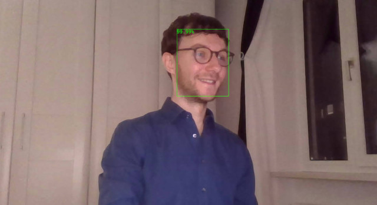

# InferCam ONNX

Turn your webcam into a face detector with Rust, [`onnxruntime`][onnxruntime] and the lightweight [ultraface
network][ultraface-gh].



## Overview
- Images are captured from the `/dev/video0` interface using the `libv4l-dev` library on Linux with the [`rscam`][rscam] crate.
- Captured frames are passed through a pre-trained network stored in the [`onnx`][onnxruntime] format, powered by the no-frills `onnxruntime` wrapper [`tract`][tract].
- Post-processing (mainly non-maximum suppression) is done in native Rust.
- Detected faces are drawn as bounding boxes on the frame with their confidences using [`imageproc`][imageproc].
- Streams from the raw video and the face detection are served in the browser with the performant [`actix_web`][actix] framework.

## Building & Running
- Make sure that you have the `libv4l-dev` package installed on your system:
```bash
sudo apt update && sudo apt install -y libv4l-dev
```

- Download a build of the `onnxruntime` from Microsoft [here][download_onnxruntime] and
install it on your system (e.g. copying the `.so` files to `~/.local/lib).

- Download the [pretrained ultraface networks][pretrained_ultraface] to the root of the repository:
```bash
wget https://github.com/onnx/models/raw/master/vision/body_analysis/ultraface/models/version-RFB-320.onnx
wget https://github.com/onnx/models/raw/master/vision/body_analysis/ultraface/models/version-RFB-640.onnx
```

- Build in release mode (there is a difference of factor 32 in fps between release and debug mode on my system):
```bash
cargo build --release
```

- Run the application:
```bash
# Without logging
./target/release/infercam_onnx

# With debug logging
RUST_LOG=debug ./target/release/infercam_onnx
```

- You can see the face detection at [http://127.0.0.1:8080/](http://127.0.0.1:8080/). The raw webcam stream is also available at [http://127.0.0.1:8080/video_stream](http://127.0.0.1:8080/video_stream).
- There are two command line arguments:
  - `--port XYZ` binds to the port XYZ.
  - `--bindall` publishes the routes on all network interfaces, not just the localhost.

## Comments
I developed this project for fun and for auto-didactic purposes. Since I have not worked with Rust
professionally, some things might not be completely idiomatic or top-notch performant.
Nevertheless, the application runs at around 8-9fps on my private laptop with a `i7-6600U` and no
dedicated GPU (when compiled with optimizations in release mode).

Initially, I considered using the [`onnxruntime` crate][onnxrcrate], but that did not work out of
the box and when I checked on GitHub, the project seems to be a lot less active than [`tract`][tract].

Not having a dedicated GPU on my private laptop, I did not go through the process of setting up
inference with [`onnxruntime`][onnxruntime] on GPU, but it should not be so much different.
An accepted inefficiency in the current implementation is that we clone the network output into
vectors for sorting. With more time, I would take a look at sorting the output in-place.

It also took a while to understand the exact meaning of the network output since I could not find
a paper/blogpost explaining it in the level of detail that I needed here. At the end, I went to the
[python demo code][py_demo_code] and reverse-engineered the meaning. I believe the output can be
interpreted like this:
- `K`: Number of bounding box proposals.
- `result[0]`: `1xKx2` tensor of bounding box confidences. The confidences for having a face in the bounding box are in the second column, so at `[:,:,1]`.
- `result[1]`: `1xKx4` tensor of bounding box candidate border points.


Every candidate bounding box consists of the **relative** coordinates `[x_top_left, y_top_left, x_bottom_right, y_bottom_right]`. They can be multiplied with the `width` and `height` of the original image to obtain the bounding box coordinates for the real frame.

Before this project, I had only used non-maximum suppression as library function and had an idea of
how it worked. Implementing it myself in Rust was fun :)
All in all, it was a nice project for me and a valuable proof of concept that Rust
is definitely a candidate language when considering to write an application for inference on edge
devices.

[onnxruntime]: https://github.com/microsoft/onnxruntime
[ultraface-gh]: https://github.com/Linzaer/Ultra-Light-Fast-Generic-Face-Detector-1MB
[rscam]: https://crates.io/crates/rscam
[tract]: https://crates.io/crates/tract
[imageproc]: https://crates.io/crates/imageproc
[actix]: https://actix.rs/
[download_onnxruntime]: https://github.com/microsoft/onnxruntime/releases/tag/v1.9.0
[pretrained_ultraface]: https://github.com/onnx/models/tree/master/vision/body_analysis/ultraface
[onnxrcrate]: https://crates.io/crates/onnxruntime/0.0.13
[py_demo_code]: https://github.com/onnx/models/blob/master/vision/body_analysis/ultraface/dependencies/box_utils.py#L111